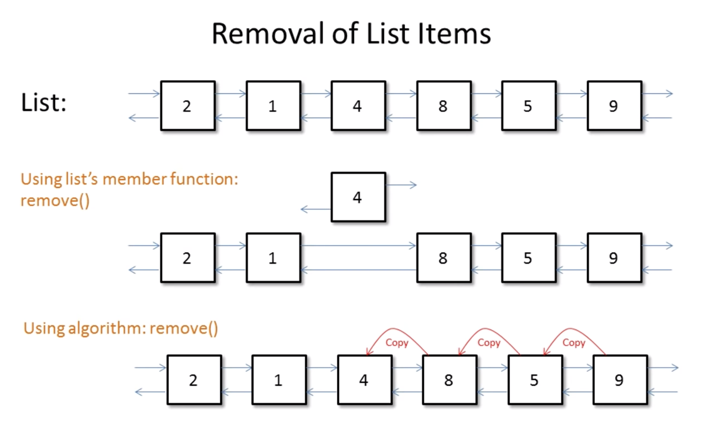

# Advanced STL

## 容器成员函数 VS 算法库函数

对于容器中定义的函数，有很多都和算法库中的同名， 如：

```cpp
// List 中成员函数
void remove(const T);  
void unique();
void sort();
void merge(list &);
void reverse();

// algorithm 中的函数
template<class Comp> void remove_if(Comp);
template<class Comp> void unique(Comp);
template<class Comp> void sort(Comp);
template<class Comp> void merge(Comp);


// 关联容器
size_type count(const T&) const;
iterator find(const T&) const;
iterator lower_bound(const T&) const;
iterator upper_bound(const T&) const;
std::pair<iterator, iterator> equal_range(const T&) const;

// 非有序容器
size_type count(const T&) const;
iterator find(const T&);
std::pair<iterator, iterator> equal_range(const T&);
```
对于到底使用成员函数还是算法库函数，下面看几个例子：

```cpp
unordered_set<int> s = {1, 2, 3, 4, 5};
unordered_set<int>::iterator itr;

// 使用成员函数 O(1)
// 成员函数了解s内部数据结构实现细节，会获取更多的信息使用最优算法
itr = s.find(4);

// 使用算法库 O(n)
// 算法库不清楚s的内部存储结构，因此只能线性的搜索
itr = std::find(s.begin(), s.end(), 4);
```

```cpp
std::map<char, std::string> mymap = {{'S', "sunday"}, {'M', "Monday"}, {"W", "Wendesday"}, ...};

// 使用成员函数 O(logN)
// map 内部数据结构为二叉树
itr = mymap.find('F');

// 使用算法库 O(n)
// 需要比较key， 和value
itr = std::find(mymap.begin(), mymap.end(), make_pair('F', "Friday"));
```

```cpp
std::list<int> x = {1, 2, 3, 4};

// 成员函数 O(n)
x.remove(2);

// 算法库 O(n)
itr = std::remove(x.begin(), x.end(), 4);
// {1, 2, 4, 4}
x.erase(itr, x.end());
```

对于list，由于其内部结构是双向链表，因此当找到元素的时候，会直接修改链表指针，进行删除；但是对于算法库，会先找到待删除的元素，然后将其后面的元素逐个向前移动一个位置，覆盖前面的元素。这样会增加移动次数，相比于成员函数来说，开销较大。



## 总结
对于容器中的成员函数和算法库中的函数，我们倾向于使用容器成员函数，由于容器成员函数更清楚自己内部的数据结构，因此会得到更多的信息，从而使用更优的算法。

<!-- ## Tricky Reverse Iterator

## Equivalence VS Equality

## Removing Elements I

## Removing Elements II

## Vectors VS Deque I

## Vectors VS Deque II

## Object Slicing -->
